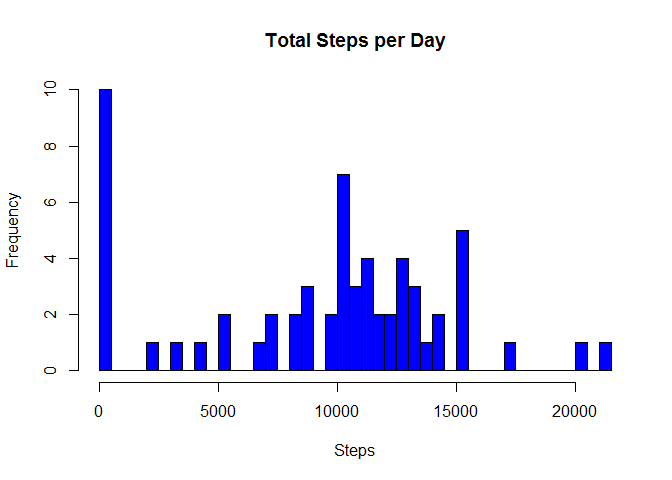
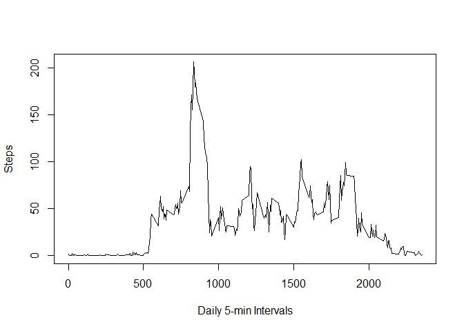
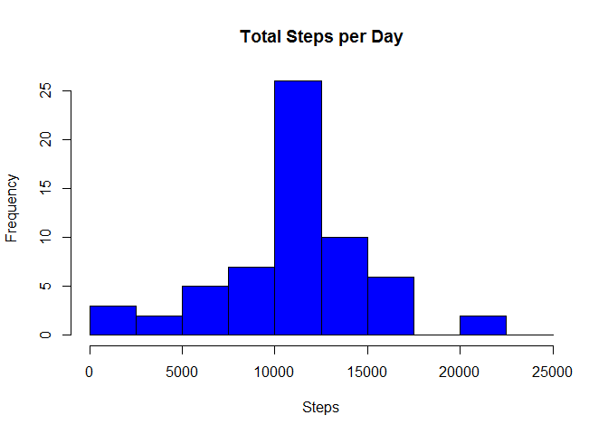

# Reproducible Research: Peer Assessment 1

<br><br>

## Loading and preprocessing the data 

      1. Load the data (i.e. read.csv())
            Note: assumed that the user and the data are in the working directory.

```r
            dframe <- read.csv("activity.csv", na.strings = "NA")
```

      2. Process/transform the data (if necessary) into a format suitable for your analysis

```r
      # Convert the data field to a date format.
            dframe$date <- as.POSIXct(dframe$date, format="%Y-%m-%d")
      
      # Add a column to the data frame for the day of the week.
            dframe$daytype <- as.factor(tolower(weekdays(dframe$date)))

      
      # label the days as weekend or weekday
            daylabeler <- function(daytype, data = dframe){
                  daylabel=ifelse(dframe$daytype == "saturday" | dframe$daytype == "sunday", "weekend", 
                           "weekday")
            }

      # Run the function and add a column to the data frame for a weekend or weekday label.
            dframe$daylabel <- as.factor(daylabeler(dframe$daytype))
      
      # Clean the workspace.
            rm(daylabeler)
```
      
<br>      
      
##   What is mean total number of steps taken per day?   

      1. Calculate total steps per day.

```r
            daySteps <- aggregate(x=list(steps=dframe$steps), by = list(dframe$date), FUN = sum, na.rm=TRUE)
```
      
      2. Make a histogram of the total number of steps taken each day

```r
            hist(daySteps$steps, xlab = "Steps", main = "Total Steps per Day", breaks = 50, col = "blue")
```




      3. Calculate the Mean and Median steps taken per day

```r
      # Mean steps per day.      
            meanSteps <- mean(daySteps$steps, na.rm = TRUE)
            meanSteps
```

```
## [1] 9354.23
```
            The mean is 9354.23 steps per day.

```r
      # Median steps per day.
            medianSteps <- median(daySteps$steps, na.rm = TRUE)
            medianSteps
```

```
## [1] 10395
```

```r
      # Clean the workspace.
            rm(daySteps)
```
            The median is 10,395 steps per day.


<br>  

##  What is the average daily activity pattern? 

      1. Make a time series plot of the 5-minute interval (x-axis) and the average number of steps taken, averaged across all days (y-axis)
      

```r
      # create an averages by interval variable
            averages <- aggregate(x=list(steps=dframe$steps), by=list(interval=dframe$interval), FUN=mean, na.rm=TRUE) 
      
      # plot the averages variable
            plot(averages$interval, averages$steps, type = "l", xlab = "Daily 5-min Intervals", ylab = "Steps")
```




      2. Which 5-minute interval, on average across all the days in the dataset, contains the maximum number of steps?

```r
            averages[which.max(averages$steps),]
```

```
##     interval    steps
## 104      835 206.1698
```
            Interval 104 at 8:35 AM has the highest average number of steps at 206.17 steps.

```r
      # Clean the workspace.
            rm(averages)
```

      
      
      

## Imputing missing values   

      1. Calculate and report the total number of missing values in the dataset.

```r
      misVals <- which(is.na(dframe$steps))     # a vector of the index location of missing values
      length(misVals)
```

```
## [1] 2304
```
            There are 2304 missing values in the dataset.


      2. Devise a strategy for filling in all of the missing values in the dataset.
      
      ### Fill the missing values with the mean.
            ### Calculate the mean value of steps per interval.
            ### Store this mean value in a vector equal in length to the vector of missing values.
            ### Copy the data frame.
            ### Replace the missing step values with the mean values by index location.

      
      3. Create a new dataset that is equal to the original dataset but with the missing data filled in.

```r
      # a vector of means equal in length to the missing values vecor
            means <- rep(mean(dframe$steps, na.rm=TRUE), times=length(misVals))     
            
      # new copy of the original data frame
            newframe <- dframe                                                      
            
      # replace the values of the missing value locations to equivalent value in the mean vector      
            newframe[misVals,"steps"] <- means
            
      # Clean the workspace.
            rm(means, misVals)
```

      4. Make a histogram of the total number of steps taken each day and Calculate and report the mean and median total number of steps taken per day.
            Do these values differ from the estimates from the first part of the assignment?
            What is the impact of imputing missing data on the estimates of the total daily number of steps?
      
      

```r
      # Make histogram
            daySteps2 <- aggregate(x=list(steps=newframe$steps), by = list(newframe$date), FUN = sum, na.rm=TRUE)
            hist(daySteps2$steps, xlab = "Steps", main = "Total Steps per Day", breaks=seq(from=0, to=25000, by=2500), col = "blue")
```



```r
      # Calculate new mean and median values for the data now that missing values have been imputed
```

```r
            meanSteps2 <- mean(daySteps2$steps, na.rm = TRUE)
            meanSteps2
```

```
## [1] 10766.19
```
            
            The new mean is 10,766.19 steps per day.
            

```r
            medianSteps2 <- median(daySteps2$steps, na.rm = TRUE)
            medianSteps2
```

```
## [1] 10766.19
```

```r
      # Clean the workspace.
            rm(daySteps2)
```
            
            The new median is 10,766.19 steps per day.

      
      
      Do these values differ from the estimates from the first part of the assignment?

```r
            meanSteps2 - meanSteps
```

```
## [1] 1411.959
```
            
            The means differ by 1411.96 steps. The mean has gone up now that missing values have been imputed.
            

```r
            medianSteps2 - medianSteps
```

```
## [1] 371.1887
```
            
            The medians differ by 371.19 steps. The median has gone up now that missing values have been imputed.
      
      
      
      What is the impact of imputing missing data on the estimates of the total daily number of steps?      
      
            Imputing values for the missing data has increased the mean by 1411.96 steps and the median by 371.19 steps.
            
            

            
## Are there differences in activity patterns between weekdays and weekends?  
      
      1. Create a new factor variable in the dataset with two levels - "weekday" and "weekend" indicating whether a given date is a weekday or weekend day.
            Note: This part of the assignment was performed in part 2 of the loading and processing data step at the beginning.
            

      2. Make a panel plot containing a time series plot (i.e. type = "l") of the 5-minute interval (x-axis) and the average number of steps taken, averaged across all weekday days or weekend days (y-axis). 


```r
            averages2 <- aggregate(steps ~ interval + daylabel, data = newframe, FUN=mean, na.rm=TRUE)
            library(lattice)
            xyplot(steps ~ interval | daylabel, averages2, layout = c(1,2), type = "l") 
```


```r
      # Clean the workspace.
            rm(averages2)
```

            Weekends appear to have a higher average of steps per day and lack a large spike in the morning as seen on weekdays.


